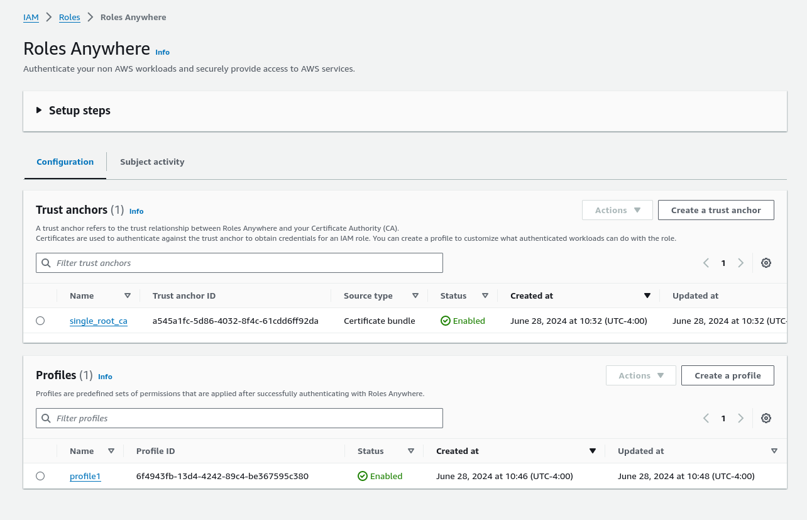
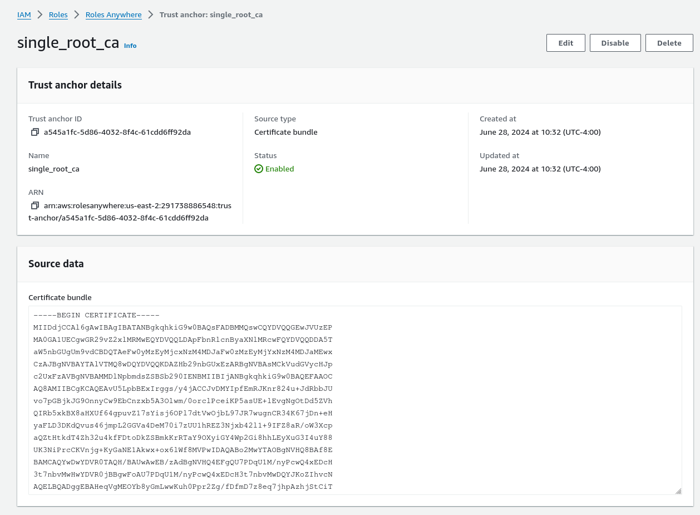
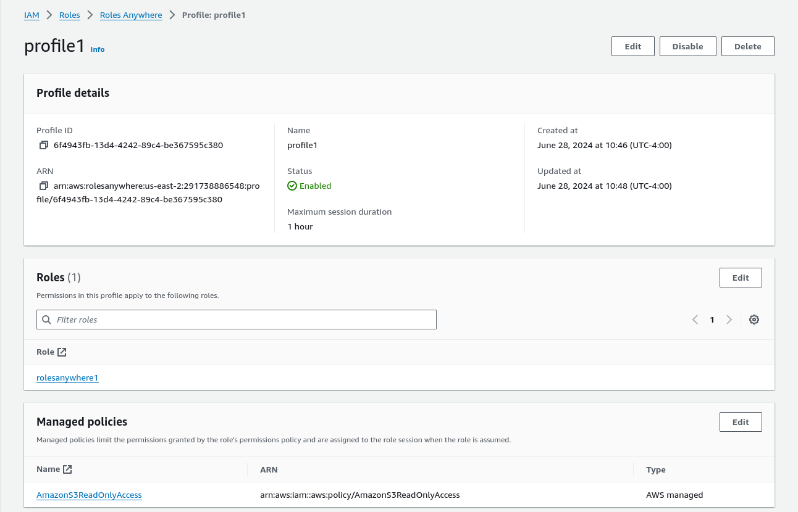
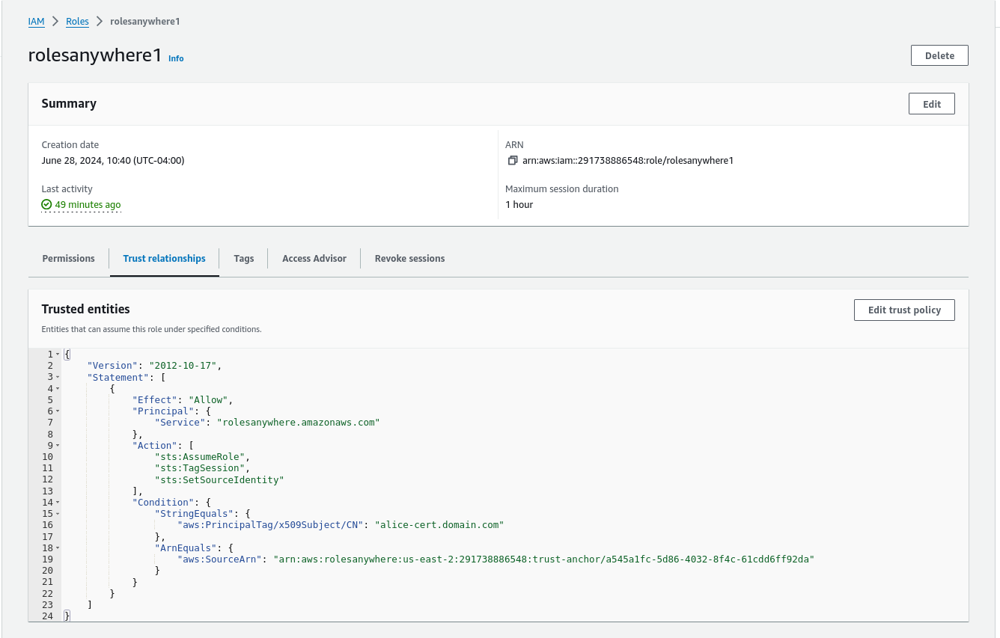
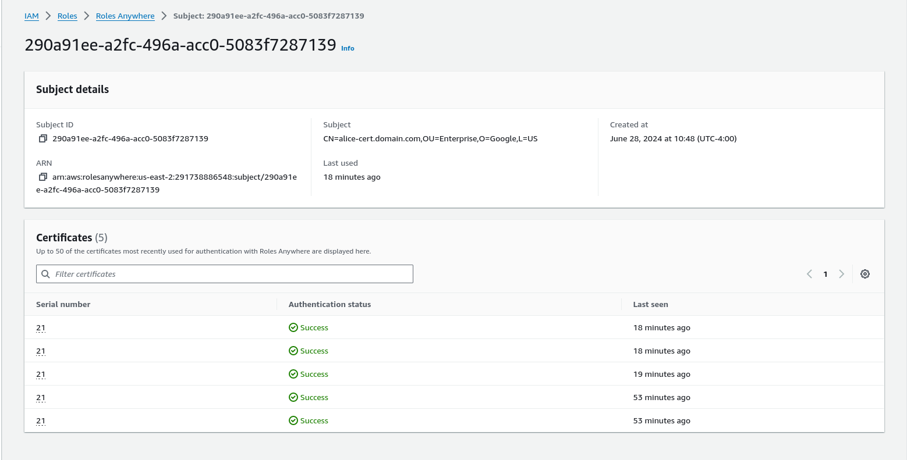

## AWS SDK CredentialProvider for RolesAnywhere

Library in go for use with AWS SDKs and [RolesAnywhere](https://docs.aws.amazon.com/rolesanywhere/latest/userguide/introduction.html).

What this library provides is basically an [AWS v2 SDK Credential](https://pkg.go.dev/github.com/aws/aws-sdk-go-v2/aws#Credentials) in go which is ultimately employing RolesAnywhere based certificates.

Unlike [rolesanywhere-credential-helper](https://github.com/aws/rolesanywhere-credential-helper), this library does _not_ require invoking an external process but rather you can use this to directly acquire credentials in code (ref [issues/352](https://github.com/aws/aws-sdk/issues/352)).  This also has the distinct flexibility to define and control the parameters for any underlying signer (eg, if you wanted to first fulfill custom policy governing access to the key like a TPM password or PCR policy)

Notably, this allows for the source of the private key used for signing to be anything that meets go's [crypto.Signer](https://pkg.go.dev/crypto#Signer) interface.

This means the private key can be form a:

* **File**

  Since in go `RSA/ECC` keys are actually [signers themselves](https://pkg.go.dev/crypto/rsa#PrivateKey.Sign)

* **TPM (Trusted Platform Module)**

  Since several libraries allows for the crypto.signer interface (eg [go-tpm-tools](https://pkg.go.dev/github.com/google/go-tpm-tools/client#Key.GetSigner), [go-tpm-keyfiles](https://github.com/Foxboron/go-tpm-keyfiles?tab=readme-ov-file#tpmsigner), and my own [salrashid123/signer/tpm](https://github.com/salrashid123/signer))

* **PKCS-11**

  Since the interface is there with [ThalesIgnite/crypto11](https://pkg.go.dev/github.com/ThalesIgnite/crypto11) and my own [salrashid123/mtls_pkcs11](https://github.com/salrashid123/mtls_pkcs11).  Sure, you can access a TPM or KMS system through PKCS-11 but that requires installing the supporting library on the system (eg `libsofthsm2.so`)

* **KMS**

  If you really wanted to, you can create a `crypto.Signer` with a KMS backed key (or you could use its pkcs11 interface, if available).  It seems azure's go sdks implements it [here](https://pkg.go.dev/go.step.sm/crypto/kms/azurekms#Signer) but on GCP, the only implementation one i know of is [my own](https://github.com/salrashid123/signer) on GCP.  This is ofcourse experimental.

I didn't actually implement [RolesAnywhere Signing process](https://docs.aws.amazon.com/rolesanywhere/latest/userguide/authentication-sign-process.html) (which seems really particular) but instead, i just used snippets found in `rolesanywhere-credential-helper` which already did the signing steps.

---

>> This library is NOT supported by google and is experimental.

---

#### About AWS_SECRET_ACCESS_KEY on TPM, KMS, PKCS11

Other than RolesAnywhere, if you are using `AWS_SECRET_ACCESS_KEY` directly, you can also embed that into a TPM or KMS or PKCS-11 device.  Thats not covered in this repo, but see: 

- [AWS Credentials for Hardware Security Modules and TPM based AWS_SECRET_ACCESS_KEY](https://github.com/salrashid123/aws_hmac)
- [AWS Process Credentials for Trusted Platform Module (TPM)](https://github.com/salrashid123/aws-tpm-process-credential)
- [AWS Process Credentials for Hardware Security Module (HSM) with PKCS11](https://github.com/salrashid123/aws-pkcs-process-credential)


### Setup

Anyway, first lets setup Roles Anywhere using the [users guide](https://docs.aws.amazon.com/rolesanywhere/latest/userguide/introduction.html)

In my case, i used the keys shown in this repo under `example/certs` for the root and the end users certificate and key (alice).  You should really use your own certificates and CA as an example...you can generate one like [this](https://github.com/salrashid123/ca_scratchpad?tab=readme-ov-file#single-level-ca)

In the end, the configuration looked like this:



With Trust Anchor which is the `example/certs/root-ca.crt`



And a profile setting allowing tuned access to S3:




And a Role which references the above settings authorizing `CN=alice-cert.domain.com` 


```json
{
	"Version": "2012-10-17",
	"Statement": [
		{
			"Effect": "Allow",
			"Principal": {
				"Service": "rolesanywhere.amazonaws.com"
			},
			"Action": [
				"sts:AssumeRole",
				"sts:TagSession",
				"sts:SetSourceIdentity"
			],
			"Condition": {
				"StringEquals": {
					"aws:PrincipalTag/x509Subject/CN": "alice-cert.domain.com"
				},
				"ArnEquals": {
					"aws:SourceArn": "arn:aws:rolesanywhere:us-east-2:291738886548:trust-anchor/a545a1fc-5d86-4032-8f4c-61cdd6ff92da"
				}
			}
		}
	]
}
```



Note, after this exercise, you could probably also see usage of this credential:



So, once i got setup, i exported the values (note the `CERT_PATH` is relative to the `example/` folder)

```bash
export REGION=us-east-2
export CERT_PATH=certs/alice-cert.crt
export ROLE_ARN=arn:aws:iam::291738886548:role/rolesanywhere1
export TRUST_ANCHOR_ARN=arn:aws:rolesanywhere:us-east-2:291738886548:trust-anchor/a545a1fc-5d86-4032-8f4c-61cdd6ff92da
export PROFILE_ARN=arn:aws:rolesanywhere:us-east-2:291738886548:profile/6f4943fb-13d4-4242-89c4-be367595c380
```

Just to test the setup, install [rolesanywhere-credential-helper](https://github.com/aws/rolesanywhere-credential-helper/releases) and  run 

```bash
aws_signing_helper credential-process \
    --certificate $CERT_PATH \
    --private-key certs/alice-cert.key \
    --role-arn $ROLE_ARN \
    --trust-anchor-arn $TRUST_ANCHOR_ARN \
    --profile-arn $PROFILE_ARN
```

If that works, you're now setup to use the backend signer of your choice

---

### Implementations and Usage

Note, I didn't actually implement [RolesAnywhere Signing process](https://docs.aws.amazon.com/rolesanywhere/latest/userguide/authentication-sign-process.html) (which seems really particular) but instead, i just used snippets found in `rolesanywhere-credential-helper` which already did the signing steps.

For basic usage, just load whatever implements the signer and supply the properties to bootstrap the credential supplier

```golang
import (
	rolesanywhere "github.com/salrashid123/aws_rolesanywhere_signer"
)
	sessionCredentials, err := rolesanywhere.NewAWSRolesAnywhereSignerCredentials(rolesanywhere.SignerProvider{
		CredentialsOpts: rolesanywhere.CredentialsOpts{
			Region:            *awsRegion,
			RoleArn:           *roleARN,
			TrustAnchorArnStr: *trustAnchorARN,
			ProfileArnStr:     *profileARN,
			Certificate:       cert,
			CertificateChain:  chain,
			Debug:             false,
		},
		Signer: key,            ///  <<<<<<<<<<<< anything that implements crypto.Signer
	})

	cfg, err := config.LoadDefaultConfig(context.TODO(), config.WithRegion(*awsRegion), config.WithCredentialsProvider(sessionCredentials))
```

### Resident vs Imported Key

All the examples below for TPM, PKCS and KMS *loads an external (imported) key*  into the device.  However, if you want to, you can create a key on the device itself, then since they all implement a `crypto.Signer`, you can generate a CSR and issue an x509 against it ...all without the key leaving the device ever.

For more information about this, see references here for [TPM](https://github.com/salrashid123/signer), [KMS](https://github.com/salrashid123/kms_golang_signer?tab=readme-ov-file#create-a-csr), [pkcs](https://github.com/salrashid123/mtls_pkcs11?tab=readme-ov-file#generate-mtls-certs)


### PEM Private Key Files

Basically, this flow just use RSA or ECC keys on disk...nothing more.

When read in, RSA/ECC keys in golang implements the crypto.Signer so we can directly read the file and apply.

The crypto.Signer here would be like

```golang
	b, err := os.ReadFile(*privateKey)
	block, _ := pem.Decode(b)
	parseResult, err := x509.ParsePKCS8PrivateKey(block.Bytes)

	key := parseResult.(*rsa.PrivateKey) 
```

As end-to-end

```bash
go run pem/main.go --privateKey=certs/alice-cert.key  \
   --certPath=$CERT_PATH \
   --awsRegion=$REGION \
   --roleARN=$ROLE_ARN \
   --trustAnchorARN=$TRUST_ANCHOR_ARN \
   --profileARN=$PROFILE_ARN
```

### TPM

This is a bit harder to setup and we'll use `tpm2_tools`, `tpm2-tss-engine-tools` and a software TPM as an example (if you want to use a real tpm, go for it).  The example below using my own crypto.Signer interface for keys..there are others from `go-tpm-tools` or `go-keyfiles` which you can use but its my repo and i can show my own stuff

anyway,

```bash
## first startup a software TPM
rm -rf /tmp/myvtpm && mkdir /tmp/myvtpm  && sudo swtpm socket --tpmstate dir=/tmp/myvtpm --tpm2 --server type=tcp,port=2321 --ctrl type=tcp,port=2322 --flags not-need-init,startup-clear --log level=5


## and export env var which allows tpm2-tools to use the swtpm
export TPM2TOOLS_TCTI="swtpm:port=2321"

## first generate a primary key, we're using the "H2 Template"
## as described in https://www.hansenpartnership.com/draft-bottomley-tpm2-keys.html#name-parent
cd example/certs

printf '\x00\x00' > /tmp/unique.dat
tpm2_createprimary -C o -G ecc  -g sha256  -c primary.ctx -a "fixedtpm|fixedparent|sensitivedataorigin|userwithauth|noda|restricted|decrypt" -u /tmp/unique.dat

tpm2_import -C primary.ctx -G rsa2048:rsassa:null -g sha256 -i alice-cert.key -u key.pub -r key.prv
tpm2_flushcontext -t
tpm2_load -C primary.ctx -u key.pub -r key.prv -c key.ctx

# sudo apt-get install tpm2-tss-engine-tools
tpm2tss-genkey -u key.pub -r key.prv private.pem

tpm2_evictcontrol -C o -c key.ctx 0x81010002
```

At this point, the private key is saved into a persistentHandle as well as a PEM key file...both are protected by the TPM and are useless outside of that system.

The basic usage is like this:

```golang
import (
	rolesanywhere "github.com/salrashid123/aws_rolesanywhere_signer"
)

	handle := tpm2.TPMHandle(*persistentHandle)

	pub, err := tpm2.ReadPublic{
		ObjectHandle: handle,
	}.Execute(rwr)

	key, err := saltpm.NewTPMCrypto(&saltpm.TPM{
		TpmDevice: rwc,
		NamedHandle: &tpm2.NamedHandle{
			Handle: handle,
			Name:   pub.Name,
		},
	})

	sessionCredentials, err := rolesanywhere.NewAWSRolesAnywhereSignerCredentials(rolesanywhere.SignerProvider{
		CredentialsOpts: rolesanywhere.CredentialsOpts{
			Region:            *awsRegion,
			RoleArn:           *roleARN,
			TrustAnchorArnStr: *trustAnchorARN,
			ProfileArnStr:     *profileARN,
			Certificate:       cert,
			CertificateChain:  chain,
			Debug:             false,
		},
		Signer: key,
	})

	cfg, err := config.LoadDefaultConfig(context.TODO(), config.WithRegion(*awsRegion), config.WithCredentialsProvider(sessionCredentials))
```

To run,

```bash
## with persistentHandle
go run tpm/nopolicy/main.go --persistent-handle=0x81010002 \
   --certPath=$CERT_PATH \
   --awsRegion=$REGION \
   --roleARN=$ROLE_ARN \
   --trustAnchorARN=$TRUST_ANCHOR_ARN \
   --profileARN=$PROFILE_ARN

## with keyfile
go run tpm/nopolicy/main.go --keyfile=certs/private.pem \
   --certPath=$CERT_PATH \
   --awsRegion=$REGION \
   --roleARN=$ROLE_ARN \
   --trustAnchorARN=$TRUST_ANCHOR_ARN \
   --profileARN=$PROFILE_ARN
```

You can also specify any TPM policy to use.  For example, suppose i create and embed a key which requires a passphrase

```bash
### policy password
tpm2_import -C primary.ctx -G rsa2048:rsassa:null -g sha256 -i alice-cert.key -u key2.pub -r key2.prv -p testpswd
tpm2_flushcontext -t
tpm2_load -C primary.ctx -u key2.pub -r key2.prv -c key2.ctx
tpm2_flushcontext -t
# sudo apt-get install tpm2-tss-engine-tools
tpm2tss-genkey -u key2.pub -r key2.prv private2.pem
tpm2_evictcontrol -C o -c key2.ctx 0x81010003
```

At this point, if you want to access the key, you must first fulfill the policy with a session:

```golang
import (
	rolesanywhere "github.com/salrashid123/aws_rolesanywhere_signer"
)

	handle := tpm2.TPMHandle(*persistentHandle)

	pub, err := tpm2.ReadPublic{
		ObjectHandle: handle,
	}.Execute(rwr)

	se, err := saltpm.NewPasswordSession(rwr, []byte(*keyPass))

	key, err := saltpm.NewTPMCrypto(&saltpm.TPM{
		TpmDevice: rwc,
		NamedHandle: &tpm2.NamedHandle{
			Handle: handle,
			Name:   pub.Name,
		},
		AuthSession: se,
	})

	sessionCredentials, err := rolesanywhere.NewAWSRolesAnywhereSignerCredentials(rolesanywhere.SignerProvider{
		CredentialsOpts: rolesanywhere.CredentialsOpts{
			Region:            *awsRegion,
			RoleArn:           *roleARN,
			TrustAnchorArnStr: *trustAnchorARN,
			ProfileArnStr:     *profileARN,
			Certificate:       cert,
			CertificateChain:  chain,
			Debug:             false,
		},
		Signer: key,
	})

	cfg, err := config.LoadDefaultConfig(context.TODO(), config.WithRegion(*awsRegion), config.WithCredentialsProvider(sessionCredentials))
```

For more information about defining and using sessions, see [here](https://github.com/salrashid123/signer/tree/master/example#tpm)

To run, specify:

```bash
go run tpm/policy_password/main.go --persistent-handle=0x81010003 --keyPass=testpswd \
   --certPath=$CERT_PATH \
   --awsRegion=$REGION \
   --roleARN=$ROLE_ARN \
   --trustAnchorARN=$TRUST_ANCHOR_ARN \
   --profileARN=$PROFILE_ARN
```

for more information, see the examples below 

### PKCS

PKCS is a quite a bit harder to setup and while it offers a generic interface, if you just want to access the TPM directly, i'd skip this and use the section above.

This bit shows how you can use [SoftHSM](https://www.opendnssec.org/softhsm/) and embed the private key using `pkcs11-tool` and optionally openssl-tss engine.

I'm using [my own implementation](https://github.com/salrashid123/mtls_pkcs11a) of crypto.signer for pkcs but you are more than welcome to use the formal, more maintained ones here by [ThalesIgnite/crypto11](https://pkg.go.dev/github.com/ThalesIgnite/crypto11)


To setup, you'll first need to install softHSM and make a copy of `example/pkcs/softhsm.conf` into the /tmp/ folder.

Make sure `libsofthsm2.so` is available, for me it was at `/usr/lib/x86_64-linux-gnu/softhsm/libsofthsm2.so`

Then initalize the hsm

```bash
cp pkcs/softhsm.conf /tmp/
export SOFTHSM2_CONF=/tmp/softhsm.conf
rm -rf /tmp/tokens
mkdir /tmp/tokens

export PKCS_MODULE=/usr/lib/x86_64-linux-gnu/softhsm/libsofthsm2.so

pkcs11-tool --module /usr/lib/x86_64-linux-gnu/softhsm/libsofthsm2.so --slot-index=0 --init-token --label="token1" --so-pin="123456"
pkcs11-tool --module /usr/lib/x86_64-linux-gnu/softhsm/libsofthsm2.so --label="token1" --init-pin --so-pin "123456" --pin mynewpin
pkcs11-tool --module /usr/lib/x86_64-linux-gnu/softhsm/libsofthsm2.so --list-token-slots

Available slots:
Slot 0 (0x2be849b): SoftHSM slot ID 0x2be849b
  token label        : token1
  token manufacturer : SoftHSM project
  token model        : SoftHSM v2
  token flags        : login required, rng, token initialized, PIN initialized, other flags=0x20
  hardware version   : 2.6
  firmware version   : 2.6
  serial num         : be6836ae82be849b
  pin min/max        : 4/255
Slot 1 (0x1): SoftHSM slot ID 0x1
  token state:   uninitialized

### now convert the private key to der and import it into the hsm

openssl pkcs8 -topk8 -nocrypt -inform PEM -outform DER     -in  certs/alice-cert.key    -out certs/alice-cert.key.der
pkcs11-tool --module $PKCS_MODULE -l --pin mynewpin --write-object certs/alice-cert.key.der --type privkey --label keylabel1 --id 01

### if openssl pkcs engine is installed for openssl3
# $ openssl engine dynamic  -pre SO_PATH:/usr/lib/x86_64-linux-gnu/engines-3/libpkcs11.so \
#      -pre ID:pkcs11 -pre LIST_ADD:1  \
#      -pre LOAD  -pre MODULE_PATH:/usr/lib/x86_64-linux-gnu/softhsm/libsofthsm2.so  -t -c

			# (dynamic) Dynamic engine loading support
			# [Success]: SO_PATH:/usr/lib/x86_64-linux-gnu/engines-3/libpkcs11.so
			# [Success]: ID:pkcs11
			# [Success]: LIST_ADD:1
			# [Success]: LOAD
			# [Success]: MODULE_PATH:/usr/lib/x86_64-linux-gnu/softhsm/libsofthsm2.so
			# Loaded: (pkcs11) pkcs11 engine
			# [RSA, rsaEncryption, id-ecPublicKey]
			# 	[ available ]
# $ export PKCS11_URI="pkcs11:model=SoftHSM%20v2;manufacturer=SoftHSM%20project;serial=be6836ae82be849b;token=token1;object=keylabel1?pin-value=mynewpin"
# $ openssl rsa -engine pkcs11  -inform engine -in "$PKCS11_URI" -pubout -out /tmp/key_pub.pem
# $ openssl rsa -pubin -inform PEM -in /tmp/key_pub.pem -outform DER -out /tmp/key_pub.der

## extract the public key and import that too
openssl rsa -in certs/alice-cert.key -pubout >  /tmp/key_pub.pem
openssl rsa -pubin -inform PEM -in /tmp/key_pub.pem -outform DER -out /tmp/key_pub.der

pkcs11-tool --module $PKCS_MODULE -l --pin mynewpin --write-object /tmp/key_pub.der --type pubkey --label keylabel1 --id 01

## now you should see both the public and private key:
pkcs11-tool --module $PKCS_MODULE  --list-objects --pin mynewpin

Using slot 0 with a present token (0x2be849b)
Public Key Object; RSA 2048 bits
  label:      keylabel1
  ID:         01
  Usage:      encrypt, verify, verifyRecover, wrap
  Access:     none
Private Key Object; RSA 
  label:      keylabel1
  ID:         01
  Usage:      decrypt, sign, signRecover, unwrap
  Access:     sensitive
```

At this point, invoke the sample which hard coded many of the PKCS settings above. 

```bash
go run pkcs/main.go  \
   --certPath=$CERT_PATH \
   --awsRegion=$REGION \
   --roleARN=$ROLE_ARN \
   --trustAnchorARN=$TRUST_ANCHOR_ARN \
   --profileARN=$PROFILE_ARN
```

### KMS

The following example with KMS is specific to Google Cloud Platform where i've implemented a basic (unsupported) crypto.Signer

* [crypto.Signer, implementations for Google Cloud KMS and Trusted Platform Modules](https://github.com/salrashid123/signer/tree/master/example)
* [Google Cloud KMS based Service Account SignedURLs](https://github.com/salrashid123/kms_service_accounts)

I'm not aware of other implementations in go but if there is one, LMK

To use this you necessarily need a a GCP account...from then, its just importing a key:

```bash
export PROJECT_ID=`gcloud config get-value core/project`
export PROJECT_NUMBER=`gcloud projects describe $PROJECT_ID --format="value(projectNumber)"`

export LOCATION=us-central1
export KEYRING_NAME=awscerts
export KEY_NAME=aws1

gcloud kms keyrings create $KEYRING_NAME --location=$LOCATION

export IMPORT_JOB=saimporter
export VERSION=1

gcloud kms import-jobs create $IMPORT_JOB \
  --location $LOCATION \
  --keyring $KEYRING_NAME \
  --import-method rsa-oaep-3072-sha1-aes-256 \
  --protection-level software


gcloud kms import-jobs describe $IMPORT_JOB \
  --location $LOCATION \
  --keyring $KEYRING_NAME

openssl pkcs8 -topk8 -nocrypt -inform PEM -outform DER     -in certs/alice-cert.key     -out /tmp/formatted.pem

gcloud kms keys create $KEY_NAME --keyring=$KEYRING_NAME --purpose=asymmetric-signing  \
   --default-algorithm=rsa-sign-pkcs1-2048-sha256 --skip-initial-version-creation --location=$LOCATION --protection-level=software

gcloud kms keys versions import   --import-job $IMPORT_JOB   --location $LOCATION  \
    --keyring $KEYRING_NAME   --key $KEY_NAME   --algorithm rsa-sign-pkcs1-2048-sha256   --target-key-file /tmp/formatted.pem
```

Once imported, you need to run

```bash
gcloud auth application-default login

go run kms/main.go  \
   --certPath=$CERT_PATH \
   --awsRegion=$REGION \
   --roleARN=$ROLE_ARN \
   --trustAnchorARN=$TRUST_ANCHOR_ARN \
   --profileARN=$PROFILE_ARN \
   --projectID=srashid-test2 \
   --kmsLocationId=us-central1 \
   --kmsKeyRing=awscerts \
   --kmsKey=aws1 \
   --kmsKeyVersion=1 
```

---


### Misc References

* [Trusted Platform Module (TPM) recipes with tpm2_tools and go-tpm](https://github.com/salrashid123/tpm2)
* [PKCS-11 Credential Source for Google Cloud SDK](https://github.com/salrashid123/gcp-adc-pkcs)
* [golang-jwt for Trusted Platform Module (TPM)](https://github.com/salrashid123/golang-jwt-tpm)
* [golang-jwt for crypto.Signer](https://github.com/salrashid123/golang-jwt-signer)
* [golang-jwt for PKCS11](https://github.com/salrashid123/golang-jwt-pkcs11)